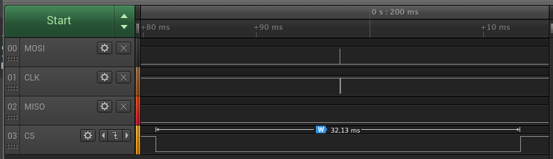
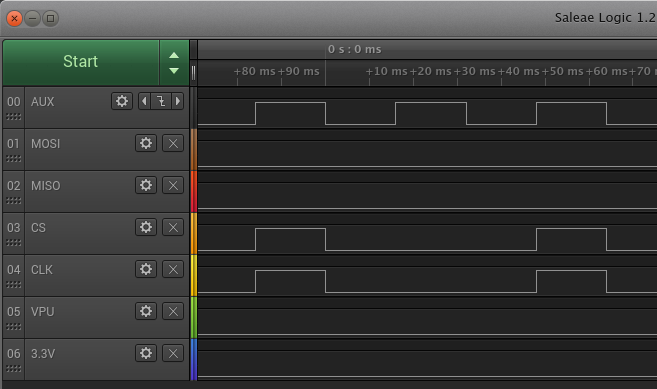
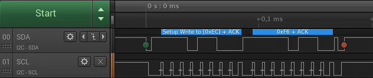

.. pyBusPirateLite documentation master file

*****************************
pyBusPirateLite Documentation
*****************************

Python library for BusPirate based on code from Garrett Berg.

It tries to be more Pythonic than the original code. This mostly means using getters/setters instead of explicit
function calls.

This library allows using the following modes:
 * SPI
 * I2C
 * UART
 * Bitbang
 * Onewire
 * Rawwire

For more information about the BusPirate see http://dangerousprototypes.com/docs/Bus_Pirate

Based on code from Garrett Berg <cloudform511@gmail.com>
(http://dangerousprototypes.com/2011/03/14/new-version-of-pybuspiratelite-python-library/)

Examples
########

SPI::

    from pyBusPirateLite.SPI import *

    spi = SPI()
    spi.pins = PIN_POWER | PIN_CS
    spi.config = CFG_PUSH_PULL | CFG_IDLE
    spi.speed = '1MHz'

    # send two bytes and receive answer
    spi.cs = True
    data = spi.transfer( [0x82, 0x00])
    spi.cs = False

The starts an SPI transfer that looks like this:

Bitbang::

    from pyBusPirateLite.BitBang import BitBang

    bb = BitBang()
    bb.outputs = bb.PIN_AUX | bb.PIN_CLK | bb.PIN_CS
    bb.pins = 0
    bb.pins = bb.PIN_AUX | bb.PIN_CLK | bb.PIN_CS
    bb.pins = 0
    bb.pins = bb.PIN_AUX
    bb.pins = 0
    bb.pins = bb.PIN_AUX | bb.PIN_CLK | bb.PIN_CS
    bb.pins = 0

This toggles the different pin like this:

I2C::

    from pyBusPirateLite.I2C import I2C

    i2c = I2C()
    i2c.speed = '400kHz'
    i2c.configure(power=True)
    i2c.write_then_read(2,0, [0xec, 0xf6])

For more see :ref:`i2c_examples`

Get BusPirate serial port::

    from pyBusPirateLite.BitBang import BitBang
    bb = BitBang(connect=False)
    port = bb.get_port()
    print(port)

Classes
#######

.. toctree::
    :maxdepth: 1

    modules

Indices and tables
------------------

* :ref:`genindex`
* :ref:`modindex`
* :ref:`search`
